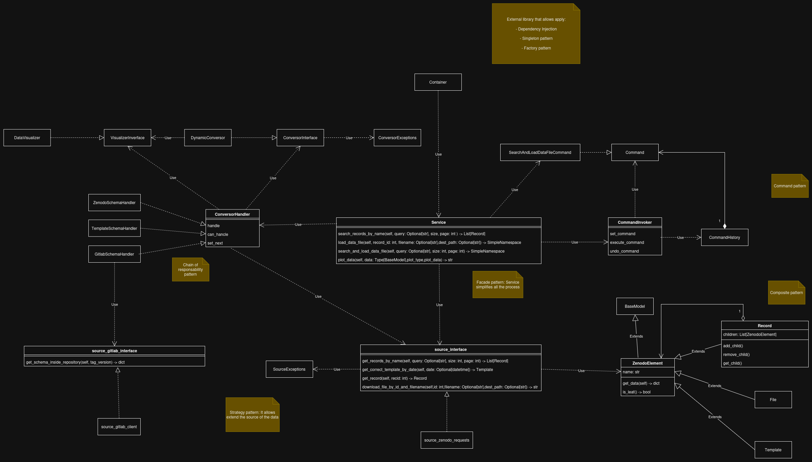

# HFLAV FAIR Client

## Overview

The HFLAV FAIR Client is a Python library designed to facilitate access to and processing of HFLAV (Heavy Flavor Averaging Group) data from various sources, including Zenodo and GitLab repositories. The library provides a unified interface for querying, transforming, and visualizing physics data while adhering to FAIR (Findable, Accessible, Interoperable, Reusable) principles.

## Use Cases

This library supports several key use cases for physics data management and analysis:

1. **Data Discovery and Retrieval** - Search and download HFLAV datasets from multiple sources
2. **Data Transformation** - Convert between different data formats and schemas
3. **Data Visualization** - Generate plots and visualizations from physics measurements
4. **Cache Management** - Efficiently cache and reuse downloaded datasets
5. **Quality Assurance** - Validate data integrity and schema compliance

For detailed use case descriptions and diagrams, see [docs/use-cases.pdf](docs/use-cases.pdf).

## Documentation

If you want to check the full documentation of this project, go to the docs folder.

The C4 architecture diagram can be checked in this picture:


And the class structure is as it can be seen in this image:



## Configuring environment variables

All the environment variables available can be seen in the `EnvironmentVariables` enum inside the [config](hflav_fair_client/config.py) file

If you want to use it in your code you should add these lines before anything:

```python
from dotenv import load_dotenv

load_dotenv()
```